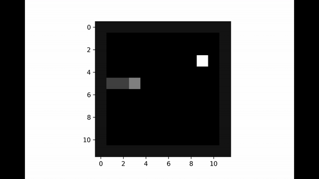
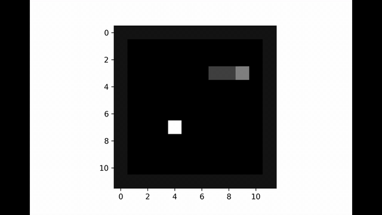
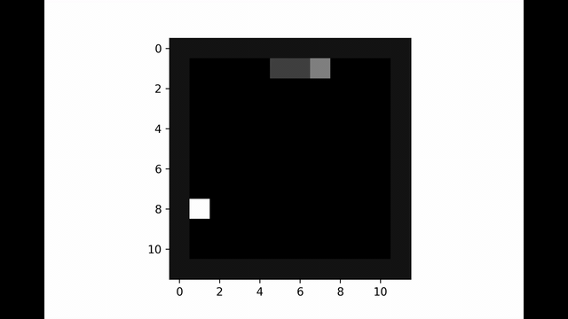
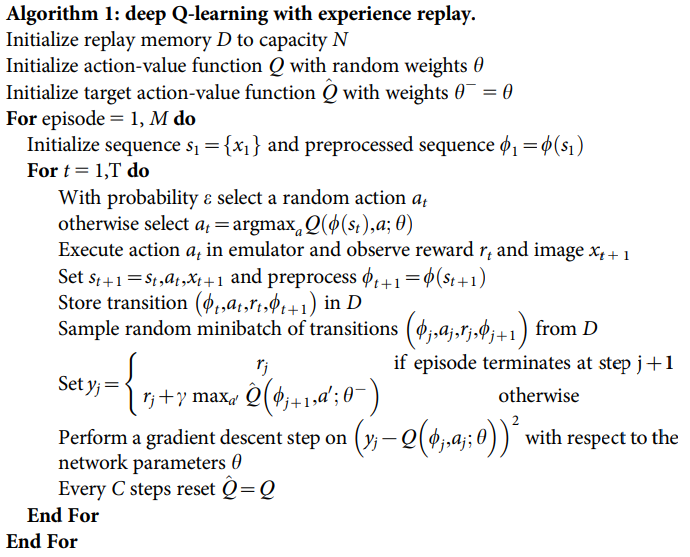

# Smart_Snake
| | 
|:--:| 
| <b> score = 49 </b> |

<table>
  <tr>
    <td> </td>
    <td> </td>
    <td> </td>
   </tr> 
   <tr> 
      <td align="center"><b>score = 48</b></td>
      <td align="center"><b>score = 46</b></td>
      <td align="center"><b>score = 43</b></td>
  </tr>
</table>

# Algorithm

| | 
|:--:| 
| *DQN Pseudo Code (https://storage.googleapis.com/deepmind-media/dqn/DQNNaturePaper.pdf)* |

###### Q = Q&theta; = Action-Value Function = Policy network
###### Q^ = Q&theta;- = Target Function = Target network
### Note:

#### The implementation has some differences with the above algorithm:

1. ##### The training (calculating loss and updating the weights) doesn't apply on the first 2000 steps.
   - ###### Because there is not enough samples in the replay memory.

2. ##### Target Network updates every C episodes (not every C steps).

# Hyperparameters
- #### C: 
   - ###### 10
- #### &gamma;: 
   - ###### 0.99
- #### Batch size : 
   - ###### 128
- #### actions : 
   - ###### (Left, Right, Up, Down) ~ (0, 1, 2, 3)
- #### Rewards : 
   - ###### (RewardFood , RewardLoose , RewardMove) ~ (100, -100, -0.1)
- #### N (Replay Memory Size) : 
   - ###### 50000
- #### M (Number of Episodes) : 
   - ###### 30000
- #### Learning rate : 
   - ###### 0.001
- #### Optimizer : 
   - ###### RMSprop

# State
### st : 
&nbsp; Frame of the game after t transitions.
##### Example:
| | 
|:--:| 
| Np array - (12 &times; 12) |

![equation](https://latex.codecogs.com/png.latex?%5Csmall%20%5Cbegin%7Bbmatrix%7D%200.08%20%26%200.08%20%26%200.08%20%26%200.08%20%26%200.08%20%26%200.08%20%26%200.08%20%26%200.08%20%26%200.08%20%26%200.08%20%26%200.08%20%260.08%20%5C%5C%200.08%20%26%200%26%200%20%26%200%20%26%200%20%26%200%20%26%200%20%26%200%20%26%200%20%26%200%20%26%200%20%260.08%20%5C%5C%200.08%20%26%200%20%26%200%20%260%20%260%20%260%20%26%200%20%26%200%20%26%200%20%260%20%26%200%20%260.08%20%5C%5C%200.08%20%26%200%26%200%26%200%20%26%200%26%200%26%200%26%200%20%26%200%26%200%26%200%260.08%20%5C%5C%200.08%20%26%200%26%200%26%200%26%200%26%200%26%200%26%200%26%200%26%200%26%200%260.08%20%5C%5C%200.08%20%26%200%26%200%26%200%26%200%26%200%26%200%26%200%26%200%26%200%26%200%260.08%20%5C%5C%200.08%20%26%200%26%200%26%200%26%200%26%200%26%200%26%200%26%200%26%200%26%200%20%260.08%20%5C%5C%200.08%20%26%200%26%200%26%200%26%200%26%200%26%200%26%201%26%200%26%200%26%200%20%260.08%20%5C%5C%200.08%20%26%200%26%200%26%200%26%200%26%200%26%200%26%200%26%200%26%200%260%20%260.08%20%5C%5C%200.08%20%26%200%26%200%26%200%26%200%26%200%26%200%26%200%26%200%26%200%260%20%260.08%20%5C%5C%200.08%26%200%26%200%26%200%26%200.25%26%200.25%26%200.5%20%26%200%26%200%20%26%200%26%200%260.08%20%5C%5C%200.08%260.08%20%260.08%20%260.08%20%260.08%20%26%200.08%20%260.08%20%26%200.08%20%260.08%20%260.08%20%260.08%20%260.08%20%5Cend%7Bbmatrix%7D)

### &phi;(st) :
&nbsp; 8 features extracted from the frame as below:
##### &nbsp; [Adjoining_wall_x, Adjoining_wall_y, food_dir_x, food_dir_y, Adjoining_body_top, Adjoining_body_bottom, Adjoining_body_left, Adjoining_body_right]

&nbsp;&nbsp;&nbsp;&nbsp;&nbsp; 

&nbsp;&nbsp;&nbsp;&nbsp;&nbsp; 

&nbsp;&nbsp;&nbsp;&nbsp;&nbsp; 
 
&nbsp;&nbsp;&nbsp;&nbsp;&nbsp; 

&nbsp;&nbsp;&nbsp;&nbsp;&nbsp; 

&nbsp;&nbsp;&nbsp;&nbsp;&nbsp; 

&nbsp;&nbsp;&nbsp;&nbsp;&nbsp; 

&nbsp;&nbsp;&nbsp;&nbsp;&nbsp; 

##### &phi;(st) for the above example:
&nbsp;&nbsp;&nbsp;

# Network
#### Input Data :
###### &nbsp; **(Batch_size, 8)**

#### Layers  : 
###### &nbsp; **FC(1024)** &rarr; **ReLU** &rarr; **FC(1024)** &rarr; **ReLU** &rarr; **FC(512)** &rarr; **ReLU** &rarr; **FC(4)** 

 
